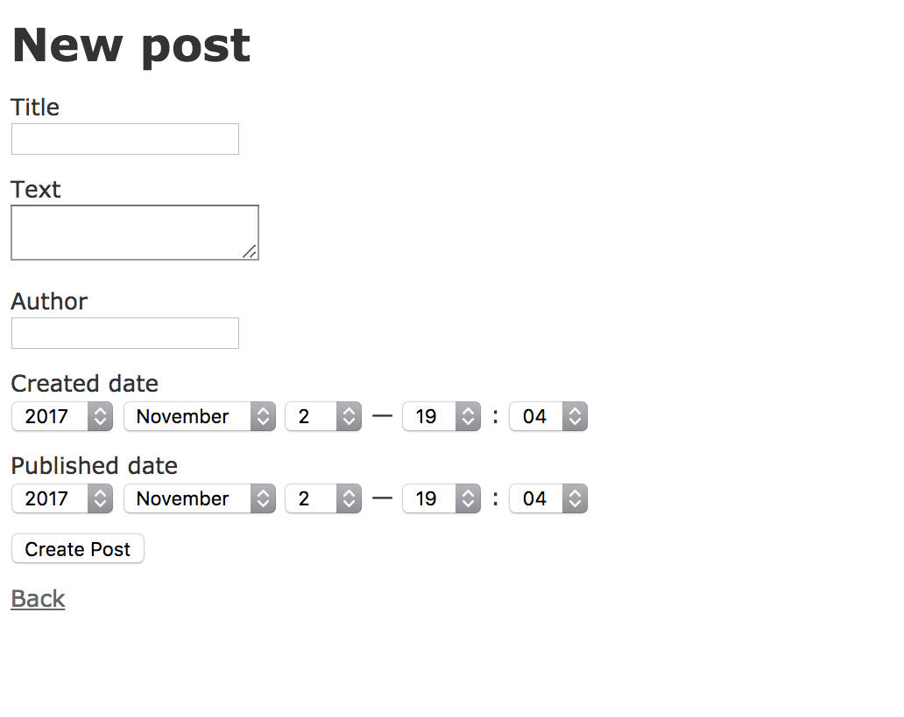

# Vamos criar alguns posts, para ver o que acontece?

Agora podemos ver a tela dos nossos posts! Mas ainda não cadastramos nenhum, vamos fazer isso?

Acesse o blog pelo navegador.

Agora podemos clicar em **New Post** e vamos ir para outra tela, como a imagem abaixo.
Podemos preencher os campos com as informações do post e clicar no botão **Create Post**



Após clicar no botão **Create Post**, vamos ir para uma página e vai ter a lista com os post que criamos.


A tela vai ter os dados do post que acabamos de criar, e uma mensagem de que foi criado com sucesso.

**Mas a mensagem está em inglês, assim como um monte de outras coisas.**

Vamos mudar isso?

### Vamos começar pelas mensagens

Vamos começar a mexer no código agora :D

Vamos abrir o arquivo `posts_controlles.rb`, que é o arquivo que controla todas as ações sobre os posts (lembra que comentamos sobre isso ao criar a rota?). Ele está em `app/controllers/posts_controller.rb`

Esse arquivo tem vários _métodos_ (lembra como são métodos no ruby?), que estão separados nas ações de criar (_create_), atualizar (_update_), excluir (_destroy_), _index_ (lembra a ação que colocamos no routes.rb?) - esta será a ação que lista todos nossos posts, _show_ (mostrar o post).

Todas essas _ações_, são métodos padrões que o Rails cria automático para nós, quando executamos aquele primeiro comando para criar o Post.

Agora, vamos procurar no arquivo onde estão as mensagens que aparecem, quando criamos ou atualizamos um post.
Por exemplo, você pode procurar o método `create`, deve ser algo como o código abaixo:

```ruby
def create
    @post = Post.new(post_params)

    respond_to do |format|
      if @post.save
        format.html { redirect_to @post, notice: 'Post was successfully created.' }
        format.json { render :show, status: :created, location: @post }
      else
        format.html { render :new }
        format.json { render json: @post.errors, status: :unprocessable_entity }
      end
    end
  end
```

Esse é o método chamado quando clicamos no botão **Create post**.
Ele cria um post novo, com os dados que colocamos nos campos e retorna o html que mostra o post, informando a mensagem. Vamos primeiro mudar a mensagem de sucesso. Você pode procurar o método `create`, na linha onde está escrito

```ruby
format.html { redirect_to @post, notice: 'Post was successfully created.' }
```

Vamos alterar para

```ruby
format.html { redirect_to @post, notice: 'O post foi criado com sucesso.' }
```

O método todo deve ficar mais ou menos assim:

```ruby
def create
    @post = Post.new(post_params)

    respond_to do |format|
      if @post.save
        format.html { redirect_to @post, notice: 'O post foi criado com sucesso.' }
        format.json { render :show, status: :created, location: @post }
      else
        format.html { render :new }
        format.json { render json: @post.errors, status: :unprocessable_entity }
      end
    end
  end
```

Agora é a sua vez, pode fazer o mesmo no método **update** e **destroy** :D

### Vamos testar a mensagem nova?

Vamos acessar no navegador a mesma url que foi usada antes :)

Vamos criar um post novo, e ver o que acontece.


Yeyy, nossa mensagem está em português!


### Continuando...

Precisamos conversar um pouquinho sobre outraaaa linguagem, **HTML**. Vai ser rapidinho ;P
